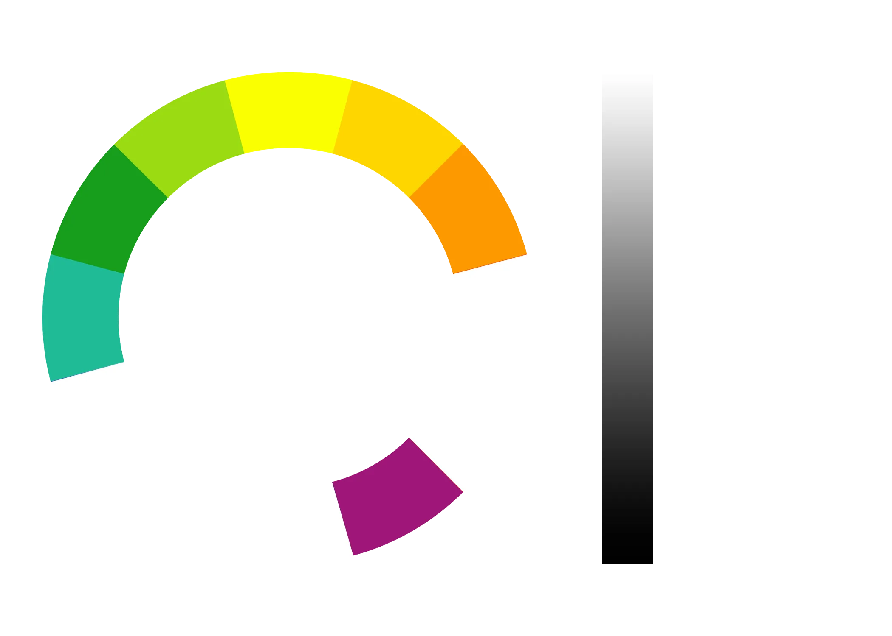
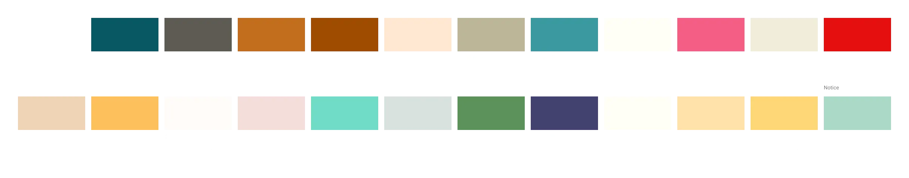

+++
image = "CatTycoon.png"
date = "2020-01-21"
title = "Immortal War: Battler RPG"
type = "gallery"
+++



- Year: 2020
- Role: UI & Concept Artist
- Tech: Photoshop, Figma
- Platforms: Android, iOS
- Engine: Unity

Idle Cat Empire: Tycoon Game is an idle factory game where you run a factory full of cat for the goal creating a cat empire. In this project, my primary responsibilities included defining the UI style, developing concept art, and creating game assets.



## UI Design

### Art Pillar

Right from start, I were aiming making the UI resemble files and documents that used in managerment, but more in toy-like style that litle children use to play with.



